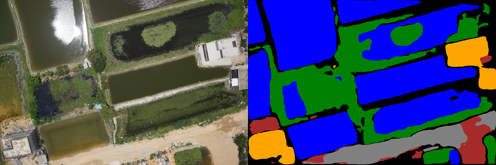
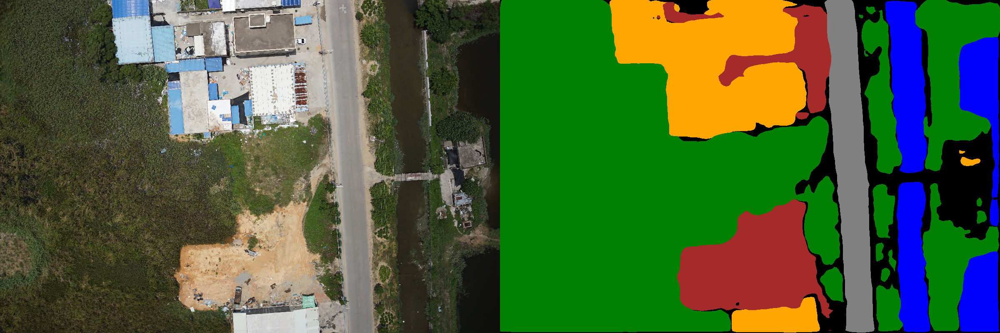

# SegNN

This is the code for comp5421 program assignment 1.

## Install Dependencies

```bash
$ pip3 install -r requirements.txt
```

## Run Example

Run the following commands under the project directory.

```bash
./run_dilated_resnet18_upernet.sh
```

## Create Your Own Model

Steps to add a model (let's call it MyNN):

1. Create you `MyNNEncoder` in `segnn/models/encoder.py` and `MyNNDecoder` in `segnn/models/decoder.py`.
2. Change `scripts/nn_make.py`, create you way to initialize the model.
3. Create `run_my_nn.sh`.

Then run the `.sh`, you result will be automatically output to the exp/ and stdout.

## Directories

```bash
.
├── data
│   └── comp5421_TASK2          <- data folder
├── exp                         <- experiment result, output of the scripts
│   └── mynn
│       ├── test                <- predicted labels for test
│       ├── ckpt
│       │   ├── ckpt            <- pytorch .pth checkpoints, will be used to predict test/val
│       │   └── config.json     <- backup training configuration in json format
│       │   └── iou.txt         <- iou of val/
│       └── val                 <- predicted labels for val
├── requirements.txt
├── run_my_nn.sh                <- executor, unix-based system required
├── scripts
│   ├── nn_forward.py           <- create labels
│   ├── nn_make.py              <- make proto .pth model to zoo/, so that nn_train.py can take it and train
│   ├── nn_train.py             <- train .pth
│   ├── parse_options.sh        <- shell utils to parse options, like argparse in python
│   ├── run.sh                  <- run train, feedforward and evaluation
│   └── visualize_mask.sh       <- visualize results
├── segnn
│   ├── data.py                 <- data set
│   ├── __init__.py
│   ├── models
│   │   ├── decoder.py          <- ppm, upernet etc.
│   │   └── encoder.py          <- resnet etc.
│   │   └── __init__.py
│   ├── transforms.py           <- overload pytorch transforms
│   └── utils.py                <- where you add your utils
└── zoo                         <- .pth created by nn_make.py
    └── my_nn.pth
```

## Result

### Validation

#### Example

```bash
$  python3 scripts/visualize_mask.py data/comp5421_TASK2/val/images  exp/dilated_resnet18_upernet_refine/val visual/refine/val
```



where

```json
{
  "unknown": "black",
  "water": "blue",
  "sky": "white",
  "road": "grey",
  "building": "orange",
  "vegetation": "green",
  "ground": "brown"
}
```

#### mIoU

```python
{'meanIoU': 0.5122276750329822, 'IoU_array': array([0.24294965, 0.87237296, 0. , 0.53663633, 0.83179963, 0.71088077, 0.39095439])}
```

### Test

#### Example

```bash
$ python3 scripts/visualize_mask.py data/comp5421_TASK2/test/images exp/dilated_resnet18_upernet_refine/test visual/refine/test
```


